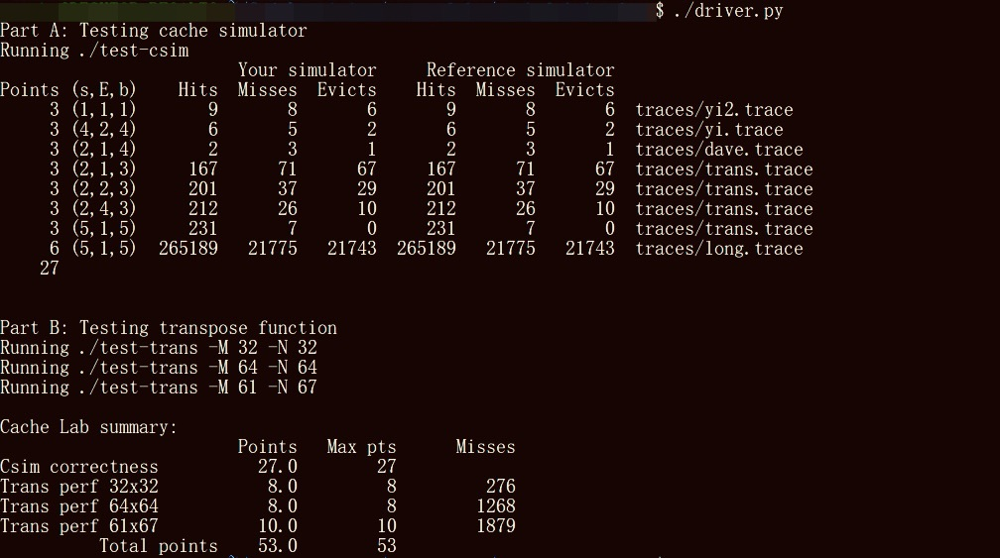

# CSAPP Learning in winter vacation of 2024

本仓库为本人大二寒假时学习CSAPP的lab记录。  
目前完成的lab有：  
- [CSAPP Learning in winter vacation of 2024](#csapp-learning-in-winter-vacation-of-2024)
  - [Datalab](#datalab)
  - [Bomblab](#bomblab)
  - [Attacklab](#attacklab)
  - [Archlab](#archlab)
    - [Part A](#part-a)
    - [Part B](#part-b)
    - [Part C](#part-c)
  - [Cachelab](#cachelab)
    - [Part A](#part-a-1)
    - [Part B](#part-b-1)


## Datalab
通过 Datalab，我对bit level的运算更加熟悉了。从基本的 xor 实现到 !x，再到条件判断的实现都让我
体会到机器通过bit进行运算的原理。其中，how_many_bits问题我没做出来，在咨询了大佬以及
google后才写下答案...ORZ  

这个lab让我深切的体会到能用高级编程语言进行编程是一件多么便利的事情，如果我是一台计算机的话，我肯定
因为思考怎么在bit level下实现程序员写的各种loop,condition,甚至是object等东西烧掉自己的CPU了吧。 
基本上每道题的思路通过代码都能直接看出来，在这里就不多重复了。 


## Bomblab
BOOM！
前面爆了几次以及调试过程中因为过于自信也爆了几次... 

这个lab让我学会了使用GDB进行调试，以及AMD标准的汇编语言更加熟悉了  
break打断点，print寄存器信息...  

Phase_6的逆向工程真是艰难，从bomb/trace.txt中就可以看出来本人是如此艰难的解决出来了。lab写完后返回去看了看，觉得应该对反汇编出来的代码做好分段再做trace。 

两个最有用的命令： 
- break * (instruction)
- disassemble instruction1,instruction2 

用第二条指令分好段后做单步执行，慢慢打印出该阶段的寄存器值就行了。

## Attacklab
遇到了奇奇怪怪的问题...  
在Ubuntu22.04运行代码 `./ctarget -q` 时无论怎么输入得到的结果都是 `Segmentation Fault`，不得不转移精力去解决该问题。 
所幸在StackOverFlow上找到了[解决方案](https://stackoverflow.com/questions/77568098/csapp-attack-lab-phase1-segmentation-fault-on-ubuntu22-04)。  
Phase_1比较简单，反汇编后找到调用`getbuf()`前栈地址减少了多少以及找到`touch1()`的指令地址就行了。  

Phase_2稍微绕了一下，要求注入自己的代码。我的解决方案是将返回地址`ret`指向`$rsp-0x28`，然后对`touch2`的指令地址做一次push后进行自己的代码操作。所以实际上只要从gdb中获取`%rsp-0x28`在哪里就可以了。  
需要注意的是指令代码不需要调整字节序，是顺序存储的。  

Phase_3的提示很微妙。  
```
As a result, you will need to be careful
where you place the string representation of your cookie.
```
`To be careful!`  
在做lab的过程中会发现基本上buffer区域都会被覆盖掉，因此将cookie对应的ascii码直接放到缓冲区是不合适的，在`GDB`中探索一番过后发现放到返回地址的上方可行...  
一注意到这个点，这个phase就很容易通过了。  

Phase_4比之前的更有难度一些，目的是在一些指令中找到`gadgets`，然后组合到一起实现目的。
对照指令表利用`ctrl+F`，耐心一点就能解决。  

## Archlab
实验环境需要做些配置，参考 [archlab_env](https://zhuanlan.zhihu.com/p/641239498)<br>
### Part A
手工汇编实现链表求和以及一个copy函数，照着书上的板子写就可以了.
### Part B
增加一条iaddq指令，搞清楚指令在各阶段的内容就可以了。<br>
通过这部分实验可以发现，同类指令只要编写得出一个，添加剩余的指令的难度不是很大。
### Part C
So Hard<br>
实现了IADDQ指令加上 6*1 循环展开勉强到了及格线，但是往下感觉有点困难，先搁置一阵子，以后有时间再精进吧...

## Cachelab
### Part A
第一部分的目标是写一个组相联Cache，采取LRU的替换策略。<br>
这部分分了几个阶段进行：<br>
- 先实现一个特定的cache，具体来说是一个(4 sets,1 line,4 blocks)的直接映射缓存
- 补全选项参数，实现通过命令行读入参数
- 实现组相联与替换策略
- 重构了代码，更加模块化
总的来说算是C语言的热身复习，对于我这种C语言菜鸡来说是个不错的练习。通过写这个part，虽然不能说已经有了solid的语言基础了，
但是打起来也比之前要有感觉多了。

### Part B
第二部分对我来说及其折磨，第一次进行性能优化...<br>
一开始没有抓到重点，以为是 `blocking` 就是并行处理，循环展开之后代码极其冗长。<br>
而后开始分析lab所使用的cache参数。<br>
`s=5,b=5,E=1`.也就是说有32个set和32个字节的block。矩阵的元素是int，一个set可以放8个元素。<br>
刚开始的时候没有特别针对测试用的三个矩阵进行设计，使用了8\*8模式处理后发现不是很理想，然后加上了一个转向操作，对32\*32的效果还行。
但是此时并没有明白为什么会有性能提升。<br>
看到handout的lab说明里有个zigzag pattern就实现了一下，结果还不如col-wise，陷入胶着。此外，由于思维陷入了用临时变量暂存缓存的圈子里，
基本都是手动展开循环，导致代码过于丑陋。<br>
在第三天重构了一下代码之后，思维慢慢打开，开始针对三个测试用例进行优化。下面直接说结果吧。
- 61\*67 不规则性，为最大限度利用sets，考虑最小化剩余处理的数量，采取8*11,col-wise的access pattern
- 32\*32 每8行会导致index冲突，且写与读也容易冲突。这一部分以8\*8为一个block进行blocking。非对角线直接用col-wise，对角线单独处理
- 64\*64 每4行会导致index冲突，且4\*8的col-wise模式会导致写区域冲突，需要采取另一种方式。这里非对角线采取ring pattern，对角线仿照32\*32的处理<br>
  

最后贴一下成果吧
